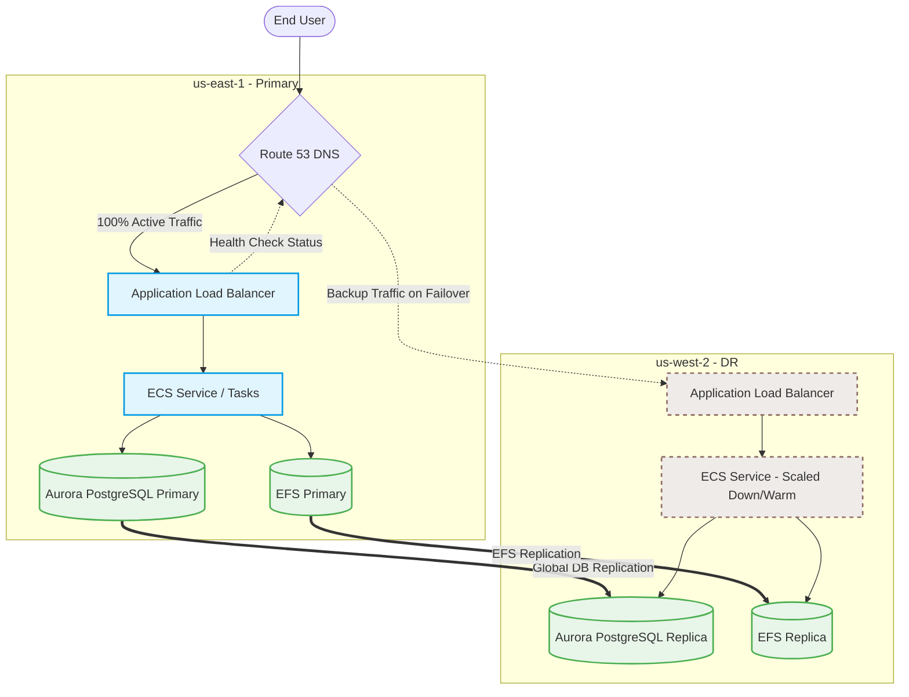

# AWS ECS Disaster Recovery (DR) Strategy & Implementation Guide

Setting up Disaster Recovery (DR) for containerized applications running on **AWS Elastic Container Service (ECS)** involves replicating your infrastructure, application images, stateful data, and traffic routing mechanisms across multiple AWS regions. 

This guide outlines the major DR strategies (from Active-Passive to Active-Active), details a step-by-step implementation plan, and provides structural architectures to ensure high availability and business continuity.

---

## 📊 Summary of DR Strategies

When designing DR for AWS ECS, you must choose a strategy based on your **RTO (Recovery Time Objective)** and **RPO (Recovery Point Objective)** requirements:

| Strategy | RTO (Recovery Time) | RPO (Data Loss) | Cost | Complexity | Description |
| :--- | :--- | :--- | :--- | :--- | :--- |
| **1. Backup & Restore** | Hours | 24 Hours | `$` | Low | Build infrastructure via IaC on-demand in secondary region. Restore databases from snapshots. |
| **2. Pilot Light** | Tens of minutes | Minutes | `$$` | Medium | Secondary region has pre-configured DB replica (running) and ECS cluster/ALB. ECS Tasks are scaled to `0`. |
| **3. Warm Standby** *(Recommended)* | Minutes | Seconds/Minutes | `$$$` | High | Scaled-down version of ECS tasks running in secondary region. Active DB replication. Rapidly scale up during failover. |
| **4. Active-Active** | Near Zero | Near Zero | `$$$$` | Very High | ECS tasks running at full capacity in both regions. Multi-Region active DB. Traffic routed dynamically. |

---

## 🏗️ Architecture Design (Active-Passive / Warm Standby)

In a typical **Warm Standby** architecture, the primary region serves 100% of production traffic. The secondary region maintains an active database replica, a configured ECS cluster with minimum active tasks (`task_count = 1`), and automatic Route 53 Active-Passive failover.



---

## 🛠️ Step-by-Step Implementation Guide

To implement a robust DR plan for your ECS-based workload, follow these key steps:

### Phase 1: Infrastructure & Application Portability (IaC & ECR)
1. **Declare Everything in IaC (Terraform / CDK)**:
   Ensure your entire VPC, ECS clusters, Task Definitions, Service configurations, Target Groups, Security Groups, and Load Balancers are fully defined in code. Avoid manual configurations.
2. **Setup ECR Cross-Region Replication**:
   Enable Amazon ECR registry replication so that when you push a Docker image to your primary region registry, it is automatically replicated to your DR region registry.
   
   *Example Registry Replication Config:*
   ```json
   {
     "rules": [
       {
         "destinations": [
           {
             "region": "us-west-2",
             "registryId": "123456789012"
           }
         ],
         "repositoryFilters": [
           {
             "filter": "*",
             "filterType": "PREFIX_MATCH"
           }
         ]
       }
     ]
   }
   ```

### Phase 2: Data Tier Replication (State Sync)
Disaster recovery is only as good as your data recovery. Address state storage:
- **Relational Databases (RDS / Aurora)**:
  Use **Amazon Aurora Global Database** or RDS Multi-Region Read Replicas. Aurora Global Database provides sub-second replication latency and allows fast failover with minimal data loss.
- **File Systems (Amazon EFS)**:
  If your ECS tasks rely on persistent volumes, use **Amazon EFS Replication** to copy file system contents to the destination DR region automatically.
- **Object Storage (Amazon S3)**:
  Configure **S3 Cross-Region Replication (CRR)** with versioning enabled on both source and destination buckets.

### Phase 3: ECS Cluster Configuration in DR
Depending on your chosen strategy, configure your ECS service in the secondary region:
- **Pilot Light**: Maintain the ECS Service but set `desired_count = 0`.
- **Warm Standby**: Run a minimal capacity footprint (e.g., `desired_count = 1` or `2`). Keep the auto-scaling configurations matching the primary region so that it can scale up rapidly under load.

### Phase 4: Route 53 Active-Passive DNS Failover
1. **Create Health Checks**:
   Create a Route 53 health check targeting the Primary region's Application Load Balancer (ALB) or a custom `/health` endpoint.
2. **Setup Failover Routing Policy**:
   - **Primary Record**: Set Routing Policy to **Failover**, choose **Primary**, and associate the record with your Primary ALB health check. Set `Evaluate Target Health` to `Yes`.
   - **Secondary Record**: Set Routing Policy to **Failover**, choose **Secondary**, pointing to the DR region's ALB. Set `Evaluate Target Health` to `Yes`.
3. **DNS TTL Configuration**:
   Ensure the TTL on your primary record is set to a low value (e.g., **60 seconds**) so DNS resolvers refresh the IP quickly when a failover occurs.

---

## ⚡ Automating the Failover & Runbook

When a regional outage occurs, you need a deterministic path to failover. **Do not rely on fully manual steps during high stress.**

### Failover Runbook (AWS CLI Scenario)

#### Step 1: Promote the Database
If using Aurora Global Database, promote the secondary region's database to become the primary cluster. This allows write operations in the secondary region.
```bash
aws rds failover-global-cluster \
    --global-cluster-identifier my-global-db \
    --target-db-cluster-identifier arn:aws:rds:us-west-2:123456789012:cluster:dr-db-cluster
```

#### Step 2: Scale Up ECS Services in DR Region
If you are using **Pilot Light** or **Warm Standby**, scale up the ECS task instances to match the production workload:
```bash
aws ecs update-service \
    --cluster my-dr-ecs-cluster \
    --service my-ecs-service \
    --desired-count 10 \
    --region us-west-2
```

#### Step 3: Verify Application Health
Check that the task instances have successfully started, registered with the Target Group, and are passing the ALB health checks:
```bash
aws elbv2 describe-target-health \
    --target-group-arn arn:aws:elasticloadbalancing:us-west-2:123456789012:targetgroup/dr-tg/xyz
```

---

## 💡 Best Practices for ECS DR

1. **Regular Game Days (Simulated Drills)**:
   Run automated simulations of regional failovers at least once every quarter. Validate both the RTO (how long it took to restore) and RPO (data consistency).
2. **Application Configuration Portability**:
   Store application settings and database connection strings in **AWS Systems Manager Parameter Store** or **Secrets Manager** in both regions. Ensure Secrets are cross-region replicated.
3. **Stateless Service Architecture**:
   Endeavor to keep your ECS services 100% stateless. Let your databases (RDS) and object storage (S3) handle the state. This makes tearing down and spinning up ECS containers trivial.
4. **Log Aggregation**:
   Ship logs from both regions to a centralized CloudWatch Logs system, an S3 bucket in a neutral region, or an external system (e.g., Datadog, ELK). This ensures troubleshooting can occur even if a region is completely down.
