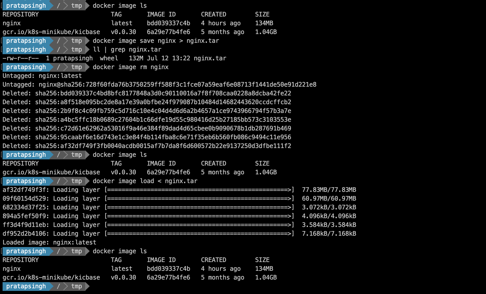

- **How to list docker images ?**

    Old way to list
    ```docker images```

    New way to list

    ```docker image ls```

    To list images but with only image-id and repository name along with comma seperated

    ```docker image ls --format '{{.ID}} , {{.Repository}}'```

- **How to check docker image history**

    ```docker image history <image_name>```

- **How to delete docker image**

    ```docker rmi <image>```

    ```docker image rm <image>```

    ```docker image rm -f <image>```

- **How to get detail information about docker image ?**

    ```docker image inspect <image>```

- **How to delete all unused image ?**

    ```docker image prune```

- **How we can share docker images to anyone apart from using any repository ?**

    ```docker image save imageName > imageName.tar```

    To use above image 

    ```docker image load < imageName.tar```
    

    

