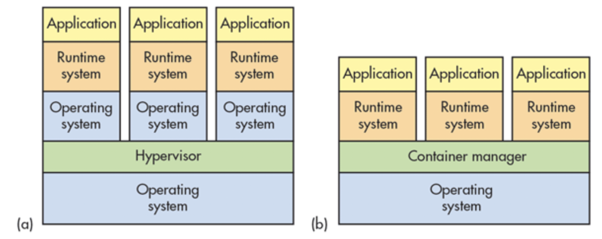

- **What is Docker?**

  Docker is a open-source lightweight containerization tool. It packages your application and all its dependencies together in the form of containers so as to ensure that your application works seamlessly in any environment, either in develpment, test or in production.

- **Difference between containerization and virtualization.**

  Virtualization helps us to create software-based or virtual versions of a computer resource. These computer resources can include computing devices, storage, networks, servers, or even applications.
  
  It allows organizations to partition a single physical computer or server into several virtual machines (VM). Each VM can then interact independently and run different operating systems or applications while sharing the resources of a single computer.


  Containerization is a lightweight alternative to virtualization. This involves encapsulating an application in a container with its own operating environment. Thus, instead of installing an OS for each virtual machine, containers use the host OS.

  |**Area**                   | **Virtualization** | **Containerization** |
  |:-------------------------:|:------------------:|:--------------------:|
  | **Isolation**| Provides complete isolation from the host operating system and the other VMs | Typically provides lightweight isolation from the host and other containers, but doesn’t provide as strong a security boundary as a VM |
  | **Operating System** | Runs a complete operating system including the kernel, thus requiring more system resources such as CPU, memory, and storage | Runs the user-mode portion of an operating system, and can be tailored to contain just the needed services for your app using fewer system resources |
  | **Deployment** | Deploy individual VMs by using Hypervisor software | Deploy individual containers by using Docker or deploy multiple containers by using an orchestrator such as Kubernetes |



- **Difference between Docker and Virtualization.**

| **Virtualization** | **Docker** |
|:------------------:|:----------:|
| Each VM runs its own OS | All Docker containers shares the same kernal of the host |
| VM takes minutes on boot up | Containers instantiate in a seconds | 
| VM uses snapshots | Images are build incrementally on the top of another like layers |
| Can not run more than couple of VMs in a average laptop | Can run multiple docker containers in a laptop |
| Not version controlled | Images can be diffed and can be version controlled |


- **Explain Docker Architecture.**

  The Docker architecture uses a client-server model and comprises of the Docker Client, Docker Host, Network and Storage components, and the Docker Registry / Hub.

  **Docker Client-** The Docker client enables users to interact with Docker. The Docker client can reside on the same host as the daemon or connect to a daemon on a remote host. A docker client can communicate with more than one daemon. The Docker client provides a command line interface (CLI) that allows you to issue build, run, and stop application commands to a Docker daemon, when you run docker commands then client sends these commands to dockerd , which carries them out.

  The main purpose of the Docker Client is to provide a means to direct the pull of images from a registry and to have it run on a Docker host.

  List of common commands issued by a client are:

  ```bash
  docker build
  docker pull
  docker run
  ```
  **Docker Host-** The Docker host provides a complete environment to execute and run applications. It comprises of the Docker daemon, Images, Containers, Networks, and Storage. The daemon is responsible for all container-related actions and receives commands via the CLI or the REST API. It can also communicate with other daemons to manage its services. **The Docker daemon pulls and builds container images as requested by the client.**

  **Docker Objects-** Various objects are used in the assembling of your application. The main requisite Docker objects are:
    1. **Images-** Images contain metadata that describe the container’s capabilities and needs. Images are used to store and ship applications.

    2. **Containers-** Containers are encapsulated environments in which you run applications. The container is defined by the image and any additional configuration options provided on starting the container, including and not limited to the network connections and storage options. Containers only have access to resources that are defined in the image.

    3. **Networking-** By default, you get three different networks on the installation of Docker.

    - None
    - Bridge
    - Host
    
    The other type of networks is user-defined networks. Administrators can configure multiple user-defined networks. There are three types
    
    - **Bridge Network-** Similar to the default bridge    network, a user-defined Bridge network differs in that there is no need for port forwarding for containers within the network to communicate with each other. The other difference is that it has full support for automatic network discovery 

    - **Overlay Network-** An Overlay network is used when you need containers on separate hosts to be able to communicate with each other, as in the case of a distributed network. This can be done with the help of Swarm.

    - **Macvlan Network-** When using Bridge and Overlay networks a bridge resides between the container and the host. A Macvlan network removes this bridge, providing the benefit of exposing container resources to external networks without dealing with port forwarding. This is realized by using MAC addresses instead of IP addresses.
    
  **Docker Registry-** It is the storage and distribution system to store docker images, By default docker interacts with **Docker-Hub**.

- **What is Service Discovery?**
  
  Service Discovery allows containers to find out about the environment they are in and find other services offered by other containers.

  It is an important factor when trying to build scalable and flexible applications.


- **What are the maximum number of containers you can run per hosts?**

  This really depends on your environment. The size of your applications as well as the amount available resources.

- **Is there a possibility that a container can restart all by itself in Docker?**

  No, it is not possible.

- **Explain Dockerfile keywords**

  Sample Dockerfile
```Dockerfile
FROM centos:7
MAINTAINER Yogendra Pr. Singh
RUN yum install -y vim
WORKDIR /usr
CMD /bin/bash
```
  - **From-** Based on which basic image.
  - **Workdir-** Specifies the directory in which the shell command runs.
  - **ADD-** Copies the files from a source on the host into the container’s own filesystem at the set destination.
  - **ENV-** Sets environment variables.
  - **EXPOSE-** Associates a specific port to enable networking between the container and the outside world.
  - **MAINTAINER-** Defines a full name and email address of the image creator.
  - **VOLUME-** It is used to enable access from the container to a directory on the host machine.
  - **LABEL-** It allows you to add a label to your docker image.
  - **RUN-** It is the central executing directive for Dockerfiles. The run instruction executes when we build the image. That means the command passed to run executes on top of the current image in a new layer. Then the result is committed to the image.

- Difference Between run, cmd and entrypoint in a Dockerfile

  To start, let's create a script, log-event.sh. It simply adds one line to a file and then prints it:

```bash
  #!/bin/sh
  echo `date` $@ >> log.txt;
  cat log.txt;
```
  And now, let's create a simple Dockerfile:

```Dockerfile
FROM alpine
ADD log-event.sh /
```

  **The run Command**

  The run instruction executes when we build the image. That means the command passed to run executes on top of the current image in a new layer. Then the result is committed to the image. Let's see how this looks in action.

  Firstly, we'll add a run instruction to our Dockerfile:

```Dockerfile
FROM alpine
ADD log-event.sh /
RUN ["/log-event.sh", "image created"]
  ```
  When we build our image we expect to have a Docker image containing a *log.txt* file with one image created line inside. Let's check this by running a container based on the image:

```sh
docker build -t myimage .
docker run myimage cat log.txt
```

  When listing the contents of the file, we'll see an output like this:

```Fri Apr 1 05:46:29 UTC 2022 image created```

  If we run the container several times, we'll see that the date in our log file doesn't change. This makes sense because the run step executes at image build time, not at the container runtime.

  Let's now build our image again. We notice the creation time in our log didn't change. This happens because Docker caches the result for the run instruction if the Dockerfile didn't change. If we want to invalidate the cache, we need to pass the –no-cache option to the build command.

  **The cmd Command**

  With the **cmd instruction, we can specify a default command that executes when the container is starting.** 
```bash
...
RUN ["/log-event.sh", "image created"]
CMD ["/log-event.sh", "container started"]
```

  Let's add a cmd entry to our Dockerfile and see how it works:

```Dockerfile
FROM alpine
ADD log-event.sh /
RUN ["/log-event.sh", "image created"]
CMD ["/log-event.sh", "container started"]
```

After building the image, let's now run it and check the output
```
$ docker run myimage
Fri Sep 18 18:27:49 UTC 2020 image created
Fri Sep 18 18:34:06 UTC 2020 container started
```

  If we run this multiple times, we'll see that the image created entry stays the same. But the container started entry updates with every run. This shows how cmd indeed executes every time the container starts.

  Notice we've used a slightly different docker run command to start our container this time. Let's see what happens if we run the same command as before:

```
$ docker run myimage cat log.txt
Fri Apr 1 05:46:29 UTC 2022 image created
```

  This time the cmd specified in the Dockerfile is ignored. That's because we have specified arguments to the docker run command.

  Let's move on now and see what happens if we have more than one cmd entry in the Dockerfile. Let's add a new entry that will display another message:

```bash
...
RUN ["/log-event.sh", "image created"]
CMD ["/log-event.sh", "container started"]
CMD ["/log-event.sh", "container running"]
```

  Let's add another cmd entry to our Dockerfile and see how it works:

```Dockerfile
FROM alpine
ADD log-event.sh /
RUN ["/log-event.sh", "image created"]
CMD ["/log-event.sh", "container started"]
CMD ["/log-event.sh", "container running"]
```
  After building the image and running the container again, we'll find the following output:

```bash
$ docker run myimage
Fri Sep 18 18:49:44 UTC 2020 image created
Fri Apr 1 06:05:13 UTC 2022 container running
```

  As we can see, the container started entry is not present, only the container running is. That's because only the last cmd is invoked if more than one is specified.

  Docker CMD commands are passed through a Dockerfile that consist of:

  - Instructions on building a Docker image.
  - Default binaries for running a container over the image.
  - Ideally, there should be a single CMD command within a Dockerfile.
  - For instances where there are multiple CMD commands in a Dockerfile, all except the last one are ignored for an execution.


  **The entrypoint Command**
  As we saw above, cmd is ignored if passing any arguments when starting the container. What if we want more flexibility? Let's say we want to customize the appended text and pass it as an argument to the docker run command. For this purpose, let's use entrypoint. We'll specify the default command to run when the container starts. Moreover, we're now able to provide extra arguments.

  Let's replace the cmd entry in our Dockerfile with entrypoint:

```Dockerfile
FROM alpine
ADD log-event.sh /
RUN ["/log-event.sh", "image created"]
ENTRYPOINT ["/log-event.sh"]
```

  Now let's run the container by providing a custom text entry:

```
$ docker run myimage container running now
Fri Sep 18 20:57:20 UTC 2020 image created
Fri Sep 18 20:59:51 UTC 2020 container running now
```

  We can see how **entrypoint behaves similarly to cmd. And in addition, it allows us to customize the command executed at startup.**

  Using CMD & Entrypoint together

  While there are fundamental differences in their operations, CMD and ENTRYPOINT instructions are not mutually exclusive. Several scenarios may call for the use of their combined instructions in a Dockerfile.

  A very popular use case for blending them is to automate container startup tasks. In such a case, the ENTRYPOINT instruction can be used to define the executable while using CMD to define parameters.


**What is the difference between CMD and entrypoint in a Dockerfile?**

CMD is an instruction that is best to use if you need a default command which users can easily override. If a Dockerfile has multiple CMDs, it only applies the instructions from the last one. 

On the other hand, ENTRYPOINT is preferred when you want to define a container with a specific executable.

🌍  I'm based in India


### Contributors
[![Yogendra Pratap Singh][yogendra_avatar]][yogendra_homepage]<br/>[Yogendra Pratap Singh][yogendra_homepage] 

  [yogendra_homepage]: https://github.com/PratapSingh13
  [yogendra_avatar]: https://img.cloudposse.com/75x75/https://github.com/PratapSingh13.png