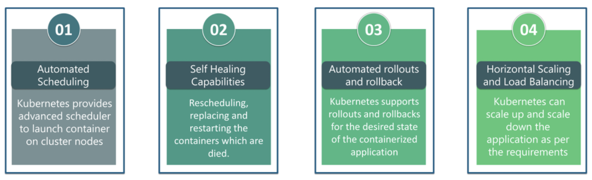
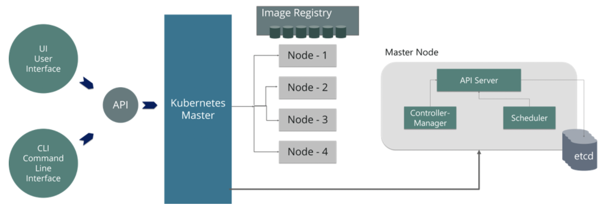
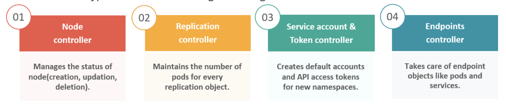
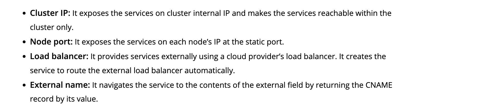

- **What is Kubernetes?**

  Kubernetes is an open-source container management tool that holds the responsibilities of container deployment, scaling & descaling of containers & load balancing.

- **How is Kubernetes different from Docker Swarm?**

|**Features**                   | **Kubernetes** | **Docker Swarm** |
|:-----------------------------:|:----------:|:-----------------:|
| **Installation & Cluster Config** | Setup is very complicated, but once installed cluster is robust. | Installation is very simple, but the cluster is not robust.|
| **GUI** | GUI is the Kubernetes Dashboard. | There is no GUI.|
| **Scalability** | Highly scalable and scales fast. | Highly scalable and scales 5x faster than Kubernetes. |
| **Auto-scaling** | Kubernetes can do auto-scaling. | Docker swarm cannot do auto-scaling. |
| **Load Balancing** | Manual intervention needed for load balancing traffic between different containers and pods.	 | Docker swarm does auto load balancing of traffic between containers in the cluster. |
| **Rolling Updates & Rollbacks** | Can deploy rolling updates and does automatic rollbacks. | Can deploy rolling updates, but not automatic rollback. |
| **Logging & Monitoring** | In-built tools for logging and monitoring.	| 3rd party tools like ELK stack should be used for logging and monitoring.|

- **What are the features of Kubernetes**



- **How does Kubernetes simplify containerized Deployment?**

  As a typical application would have a cluster of containers running across multiple hosts, all these containers would need to talk to each other. So, to do this you need something big that would load balance, scale & monitor the containers. Since Kubernetes is cloud-agnostic and can run on any public/private providers it must be your choice simplify containerized deployment.

- **Can you brief on the working of the master node in Kubernetes?**

  Kubernetes master controls the nodes and inside the nodes the containers are present. Now, these individual containers are contained inside pods and inside each pod, you can have a various number of containers based upon the configuration and requirements. So, if the pods have to be deployed, then they can either be deployed using user interface or command-line interface. Then, these pods are scheduled on the nodes, and based on the resource requirements, the pods are allocated to these nodes. The kube-apiserver makes sure that there is communication established between the Kubernetes node and the master components.

  

- **What is the role of kube-apiserver and kube-scheduler?**

  **kube – apiserver** follows the scale-out architecture and, is the front-end of the master node control panel. This exposes all the APIs of the Kubernetes Master node components and is responsible for establishing communication between Kubernetes Node and the Kubernetes master components.

  **kube-scheduler** is responsible for the distribution and management of workload on the worker nodes. So, it selects the most suitable node to run the unscheduled pod based on resource requirement and keeps a track of resource utilization. It makes sure that the workload is not scheduled on nodes that are already full.

- **What is Kubernetes controller manager?**

  Multiple controller processes run on the master node but are compiled together to run as a single process which is the Kubernetes Controller Manager. So, Controller Manager is a daemon that embeds controllers and does namespace creation and garbage collection. It owns the responsibility and communicates with the API server to manage the end-points.

  

- **What is ETCD?**

  Etcd is written in Go programming language and is a distributed key-value store used for coordinating distributed work. So, Etcd stores the configuration data of the Kubernetes cluster, representing the state of the cluster at any given point in time.

- **What is Ingress network, and how does it work?**

  Ingress network is a collection of rules that acts as an entry point to the Kubernetes cluster. This allows inbound connections, which can be configured to give services externally through reachable URLs, load balance traffic, or by offering name-based virtual hosting. 
  
  So, Ingress is an API object that manages external access to the services in a cluster, usually by HTTP and is the most powerful way of exposing service.

  
- **What is Liveness Probe and Readiness Probe**

  Liveness and Readiness probes are used to control the health of an application running inside a Pod’s container. Both of them are very similar in functionality, and usage.

  **Liveness Probe-** Suppose that a Pod is running our application inside a container, but due to some reason let’s say memory leak, cpu usage, application deadlock etc the application is not responding to our requests, and stuck in error state.

  Liveness probe checks the container health as we tell it do, and if for some reason the liveness probe fails, it restarts the container.

  **Readiness Probe-** In some cases we would like our application to be alive, but not serve traffic unless some conditions are met e.g, populating a dataset, waiting for some other service to be alive. In such cases we use readiness probe. If the condition inside readiness probe passes, only then our application can serve traffic.
 
- **What is ClusterIP,  NodePort,  Ingress and  LoadBalancer?**
   
  - Using Kubernetes proxy and ClusterIP: The default Kubernetes service type is ClusterIp, which exposes the Service on a cluster-internal IP. To reach the ClusterIp from an external source, you can open a Kubernetes proxy between the external source and the cluster. This is usually only used for development.

  - Exposing services as NodePort: Declaring a Service as NodePort exposes it on each Node’s IP at a static port (referred to as the NodePort). You can then access the Service from outside the cluster by requesting <NodeIp>:<NodePort>. This can also be used for production, albeit with some limitations.
  default range of nodeport is 30000-32767

  - Exposing services as LoadBalancer: Declaring a Service as LoadBalancer exposes it externally, using a cloud provider’s load balancer solution. The cloud provider will provision a load balancer for the Service, and map it to its automatically assigned NodePort. This is the most widely used method in production environments.

- **What is Ingress ?**

  Ingress isn’t a type of Service, but rather an object that acts as a reverse proxy and single entry-point to your cluster that routes the request to different services. The most basic Ingress is the NGINX Ingress Controller, where the NGINX takes on the role of reverse proxy, while also functioning as SSL.

- **What are different kinds of services in Kubernetes?**
  

- **What is difference between ReplicaSet and ReplicationController?**

  Replica Set and Replication Controller both are almost the same thing. Both of them ensure that a specified number of pod replicas are running at any given time. The difference comes with the usage of selectors to replicate pods. **Replica Set use Set-Based selectors while replication controllers use Equality-Based selectors.**

  ReplicaSets can be used independently, today it’s mainly used by Deployments as a mechanism to orchestrate pod creation, deletion, and updates.

  **ReplicationController** -> environment = production
  **ReplicaSet** -> environment in (prod, test)

  Here in **ReplicationController** example it selects all resources with key equal to *environment* and value equals to *production*
  But in **ReplicaSet** example it selects all resources with key equal to *environment* and value equals to *prod* or *test*

- **How to delete replication controller but do not delete pods from that replication controller?**

  ```kubectl delete rc --cascade=false <replicationControllerName> --namespace```

- **What is init containers ?**

  **Init containers** run before the **regular containers**, usually to prepare a config or make some changes in the environment which regular container/s will need on startup.

  **Regular containers** start only AFTER **init container/s** successfully completed their work.

  **Use Case of init containers**

  If you want to configure your application setup to wait until the DB is up and running before it starts: you will have a regular container with your app and an init container that sends some discovery commands to DB.

  So once it gets a response from DB, it will exit and the regular app container can start.

- **What is a Container Runtime?**

  A system that is running containers is only doing so because of its container runtime. The container runtime is the software installed on a host system that allows it to isolate its resources for containers, pull down container images, and manage the lifecycle of containers.

  With respect to Kubernetes, a container runtime is required on every node in your cluster. Without it, pods in Kubernetes are non-existent.

- **How to do maintenance activity on the K8 node**

  ```bash
    kubectl cordon
    kubectl drain –ignore-daemon set
  ```

- **How to change k8s default namespace with something else namespace apart from 'default'**

  ```bash
    kubectl config set-context --current --namespace=<namespace name>
  ```

- **Can we fix resource limits in a namespace if yes then how**

  Yes we can fix using resourceQuota.

- **How many types of resourceQuota we can use?**

    - Object Quota

    - Compute Quota

- **Can we give limitResource without specifiying requestResource if yes then what will be the requestResource?**

  Yes we can do this but if we used resorceQuota in a namespace then the requestResource will be same as limitResource by default.

- **Can we give requestResource without specifiying limitResource if yes then what will be the limitResource?**

  No we can not do this if we used resourceQuota in a namespace.

- **How do you rollback you application deployment version to previous version?**

  ```bash
    kubectl rollout history deployment <deployment-name>
    kubectl rollout undo deployment < deployment-name>
  ```

- **How do you rollback you application deployment version to a specific version?**

  ```bash
    kubectl rollout history deployment <deployment-name>
    kubectl rollout undo --to-revision=<number of specific version> deployment < deployment-name>
  ```

- **If a container keeps crashing, how do you troubleshoot?**

  You can use --previous option with logs command to see the logs of a crashed container.
  
  ```kubectl logs --previous```


### Contributors
[![Yogendra Pratap Singh][yogendra_avatar]][yogendra_homepage]<br/>[Yogendra Pratap Singh][yogendra_homepage] 

  [yogendra_homepage]: https://www.linkedin.com/in/yogendra-pratap-singh-41630716b/
  [yogendra_avatar]: https://img.cloudposse.com/75x75/https://github.com/PratapSingh13.png
