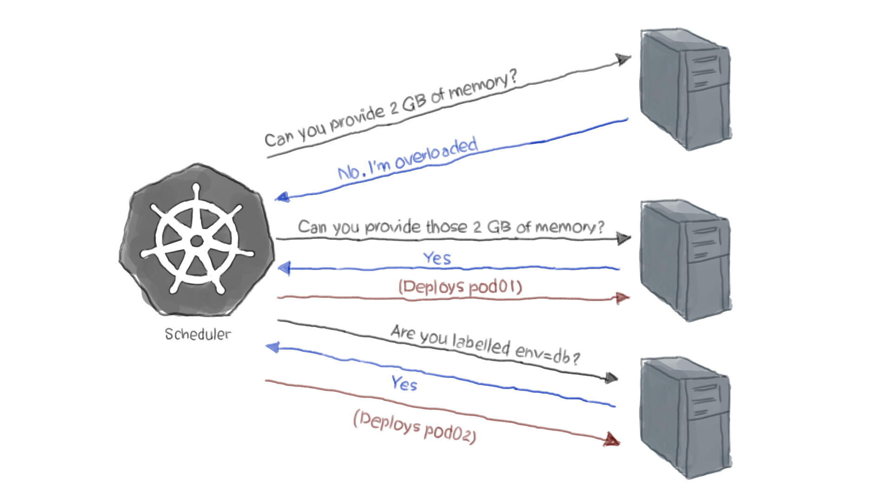

# A Deep Dive into Kubernetes Scheduling


Kubernetes Scheduler is one of the core components of the Kubernetes control plane. It runs on the control plane and its default behavior assigns pods to nodes while balancing resource utilization among them. 

When the pods are assigned to a new node, the kubelet running on the node retrieves the pod definition from the Kubernetes API. Then, the kubelet creates the resources and containers according to the pod specification on the node.

## An overview of Scheduling
Kubernetes scheduling is simply the process of assigning pods to the matched nodes in a cluster. A scheduler watches for newly created pods and finds the best node for their assignment. It chooses the optimal node based on Kubernetes’ scheduling principles and your configuration options.

The simplest configuration option is setting the nodeName field in podspec directly as follows:

```yaml
apiVersion:v1
kind:Pod
metadata:
  name:nginx
  containers:
spec:
    name:nginx
    image:nginx
  nodeName:node-01
```

Here the nginx pod above will run on node-01 by default.

However, **nodeName** has many limitations that lead to non-functional pods

-   Node names in the cloud
-   Out of resource nodes
-   Nodes with intermittent network problems

For this reason, you should not use nodeName at any time other than during testing or development.

If you want to run your pods on a specific set of nodes, use **nodeSelector** to ensure that happens. You can define the **nodeSelector** field as a set of key-value pairs in ‘PodSpec’

```yaml
---
apiVersion: apps/v1
kind: Deployment
metadata:
  name: nginx
  namespace: namespace
spec:
    nodeSelector:
      Name: dev-cluster
    containers:
    - name: nginx
      image: nginx
      imagePullPolicy: Always
```

Here the nginx pod above, Kubernetes Scheduler will find a node named dev-cluster.

There are two more comprehensive features in Kubernetes to express more complicated scheduling requirements:

-   Node Affinity
-   Taints and Tolerations

### What is node affinity


### Contributors
[![Yogendra Pratap Singh][yogendra_avatar]][yogendra_homepage]<br/>[Yogendra Pratap Singh][yogendra_homepage] 

  [yogendra_homepage]: https://www.linkedin.com/in/yogendra-pratap-singh-41630716b/
  [yogendra_avatar]: https://img.cloudposse.com/75x75/https://github.com/PratapSingh13.png