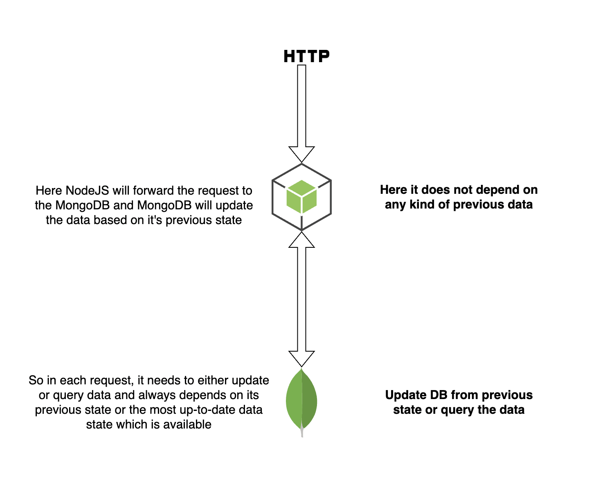
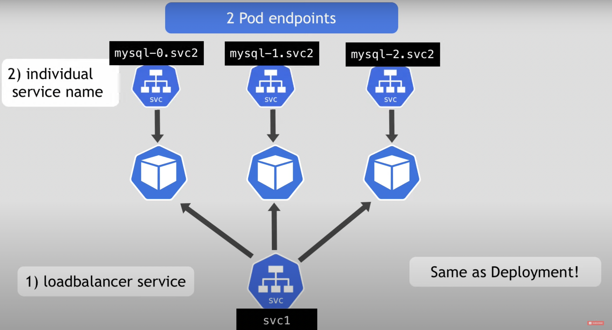

# Kubernetes StatefulSet explained

- **What is StatefulSet?**

- **Why StatefulSet is used?**

- **How StatefulSet works and how it is different from deployment?**

## What is StatefulSet?
It's a Kubernetes component that is used specifically for stateful applications.

### What is a Stateful application?
Any application that stores data to keep track of its state. Or we can say that the applications that track state by saving information in some storage.

Examples of Stateful applications are all kind of Databases
- MongoDB
- MySQL
- ElasticSearch

## What is a Stateless application?
Those application that do not need to keep records of previous request and interaction is handled as completely new and isolated based on information that comes with it.

**Note-: Sometimes stateless applications need to stateful application to forward the request.**





## Deployment of Stateful and Stateless application
Stateful application is used to deploy using **Statefulset** component of Kubernetes.

Stateless application is used to deploy using **Deployment** component Kubernetes.


- Just like deployment statefulset makes it possible to replicate application pods or to run multiple replicas of it.

- You can also configure storage with both of them equally in the same way.


### So what is the difference between Statefulset and Deployment or why we should use different ones for each type of application

## StatefulSet vs Deployment

- Replicating stateful applications is more difficult and has a couple of requirements that stateless applications do not have.

*Let's discuss an example*

Let's say we have one MongoDB pod that handles requests from the NodeJs application pod which is deployed using deployment. Let's say we have scaled NodeJs application pod from 1 to 3 so they can handle more client requests and in parallel, you scale MongoDB pod so that they can handle more NodeJs request.

Scaling is your NodeJs application is pretty straightforward, pods will be identical and interchangeable so that to scale up deployment is pretty easy. The deployment will create the pods in any random order and they will get random hashes at the end of pod name ```NodeApp-f5cdee```, ```NodeApp-fasx34```, ```NodeApp-ax7jds```.

The deployment will get one ```svc``` which helps to load balance to any pod of any request.

When you delete or scale down the deployment they will delete them in any random order at the same time.

If we talk about MongoDB pod replicas that were deployed using statefulset can not be created and deleted at the same time in any order and con not be randomly addressed. The reason behind this is replica pods of statefulset are not identical because they each have their own additional identity of the pods.

**Note-: Giving each pod its own required identity makes the difference between stateful and deployment**

Statefulset maintains a sticky identity for each pod so *they are created from the same specification but are not interchangeable!*

It has a persistent identifier across any re-scheduling which means that when a pod dies it is replaced by a new pod and keeps the same identity.


**But why is this identity nescessary ?**

If we talk about a single MongoDB pod that used to be both reading and writing the data but if you add the second pod of MongoDB this can not act as the same way because if we allow instances of MongoDB to change the data that will end up with data inconsistency.

So instead there is a mechanism that decides that only the pod is allowed to write or change the data which is shared for multiple MongoDB instances for reading so the pod which allows changing the data is called **master** and others are called **slave**.

**Note-: Master and slaves don't use the same physical storage even though they use the same data.**

## Pod Identity
- In stateful every pod has its own identifier and gets a fixed order name but not the same in the case for deployment.

- If we create a satefulset replicas of 3 then it will create like ```MongoDB-0```, ```MongoDB-1```, ```MongoDB-2``` here the first one is master in next are slaves.

**Note-: The statefulset will not create the next pod in the replica of the previous pod is not already running and up and the same order is for deletion but in reverse order.**

## Pod Endpoints
- Each pod in statefulset gets its own DNS endpoint from the service.



So finally we can say that the Statefulset application has 2 characters


1. Predicatble pod name
2. Fixed individual DNS name 

When pods restart then IP address will change but name and endpoints still the same.


-------------------------------------------------------------------------

### Contributors
[![Yogendra Pratap Singh][yogendra_avatar]][yogendra_homepage]<br/>[Yogendra Pratap Singh][yogendra_homepage] 

  [yogendra_homepage]: https://github.com/PratapSingh13
  [yogendra_avatar]: https://img.cloudposse.com/75x75/https://github.com/PratapSingh13.png