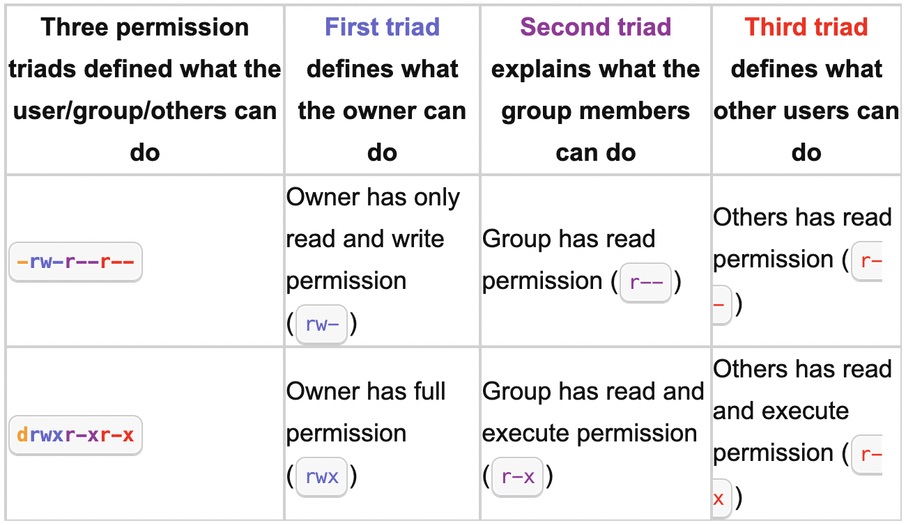

# Understanding file permissions for chmod and chown command

## chmod
This command is used to change or modify the permission of any file or directory.

```
User permissions -> Group permissions -> Other permissions
```

|**First character**   | **Description**        |
|:--------------------:|:----------------------:|
| **-**                | Regular file           |
| **b**                | Block special file     |
| **c**                | Character special file | 
| **d**                | Directory              |
| **l**                | Symbolic link          |
| **p**                | FIFO                   |
| **s**                | Socket                 |
| **w**                | Whiteout               |



## chmod command

```bash
chmod permission file
chmod permission dir
chmod UserAccessRightsPermission file
```
**We can use the following letters to change permission**
    
-   ```u```  for user
-   ```g```  for group
-   ```o```  for others
-   ```a```  for all

**We can set or remove file permission using the following letters:**

-   ```+``` for adding
-   ```-``` for removing
-   ```=``` set exact permission

**File permission letter is as follows:**
-   ```r``` = ```4``` for readOnly
-   ```w``` = ```2``` for writeOnly
-   ```x``` = ```1``` for executeOnly


## chown
This command is used to change the ownership of any file or directory.

```bash
chown owner-user:owner-group file
chown owner-user:owner-group directory
```


