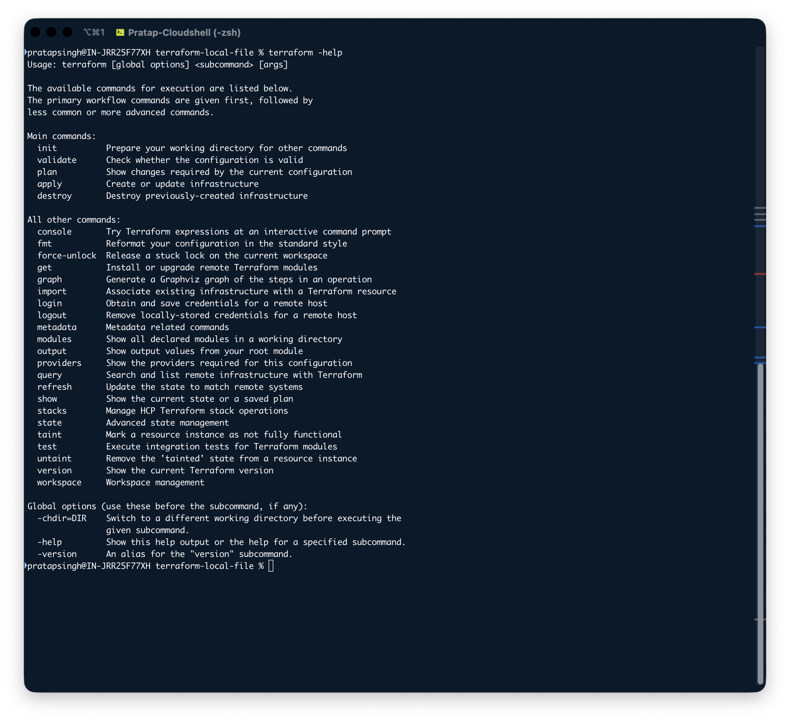

# Terraform Cheat Sheet

## Get help

```terraform -help``` Get a list of available commands for execution with description. Can be use with any sub-command to get more information.



```terraform apply -help``` display the help options for ```apply``` command.

## Check Terraform version

```terraform version``` shows the current version of the terraform and notifies you if there is a newer version available.

## Format terraform code

```terraform fmt``` format your code configuration files using the HCL language standard.

```terraform fmt -recursive``` format files but in su-directories also.

